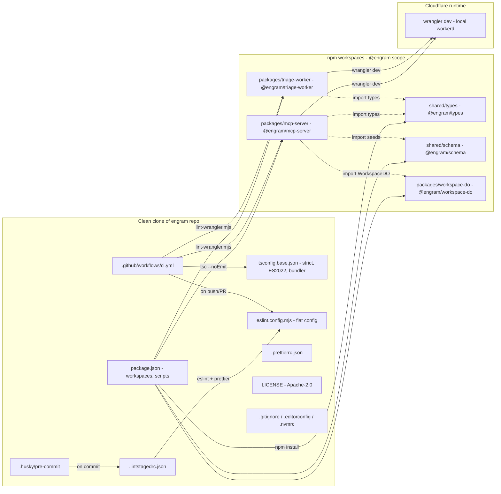

<!-- TODO: confirm owner after first push -->

[](LICENSE)
[](https://github.com/russellkmoore/engram/actions/workflows/ci.yml)
[](package.json)

# Engram

Open-source, MCP-native second brain for AI assistants — persistent memory that the user owns and any MCP client can query.

---

## Why Engram

Every AI client — Claude, Perplexity, Antigravity — faces the same problem: no persistent memory across conversations. Each session starts fresh. Context you built last week is gone. You re-explain your stack, your preferences, your project history, your team, every single time.

Engram fixes that by giving any MCP-compatible client a structured, searchable, semantic memory layer that the user owns and controls. Think of it as your second brain — but built for AI to query, not for humans to browse.

**The key inversion:** Notion was built for humans to browse. Engram is built for AI to query. The MCP tool surface is the product. A human UI is a secondary convenience layer.

Engram does the heavy lifting so Claude doesn't have to. CF Workers AI handles embeddings, entity extraction, chunking, summarization, conflict detection, and deduplication. Claude handles reasoning, synthesis, and user interaction. Engram returns insights — not raw records.

---

## Architecture



> See [docs/architecture.svg](docs/architecture.svg) for the polished hero diagram.

---

## Tech Stack

| Layer               | Technology                                        |
| ------------------- | ------------------------------------------------- |
| Compute             | Cloudflare Workers (TypeScript)                   |
| Workspace storage   | Cloudflare Durable Objects (SQLite per workspace) |
| Semantic search     | Cloudflare Vectorize                              |
| AI processing       | Cloudflare Workers AI                             |
| Async pipeline      | Cloudflare Queues                                 |
| File/export storage | Cloudflare R2                                     |
| Config/metadata     | Cloudflare KV                                     |
| Runtime             | Wrangler + TypeScript                             |
| Package manager     | npm workspaces (monorepo)                         |

---

## Status

**Current milestone:** v0.1 — MCP Foundation (in progress, target 2026-06-07)

Phases 1-6 complete (Foundation → WorkspaceDO + SQLite → MCP Server Scaffold → Core Tools + Envelope → AI Integration → Async Pipeline). Phase 7 (Deploy + Acceptance) is the active phase.

See [.planning/ROADMAP.md](.planning/ROADMAP.md) for the full milestone arc.

---

## Getting Started

### Prerequisites

- Node 22+, npm 10+
- A Cloudflare account (only needed for deploy; `wrangler dev` runs locally — no account required)

### 1. Install

```bash
# Clone the repo
gh repo clone russellkmoore/engram
cd engram

# One-command bootstrap: installs deps, generates types, provisions
# Vectorize index + Queue (idempotent — safe to re-run).
npm run setup

# Verify the monorepo is healthy
npm run typecheck && npm run lint && npm run lint:wrangler
```

`npm run setup` chains `npm install` + `npm run types:gen` + `npm run setup:vectorize` + `npm run setup:queue` + a completion echo. The setup scripts skip if their target already exists, so re-running on an established environment is a no-op.

### 2. Deploy

```bash
npm run deploy
```

Ships both Workers to your Cloudflare account. The `predeploy` hook runs the eval gate (`npm run evals:ci`) first; on green, mcp-server deploys, then triage-worker. See [Deploy](#deploy) below for the full reference (surgical re-deploys, eval-gate failure handling, deploy-order invariant).

### 3. Bootstrap Claude Desktop + KV (one interactive command)

ENG-11 ships a single interactive script that does the entire first-run dance for you — merging Claude Desktop's config (preserving any other MCPs you have configured), prompting for sensible defaults derived from `git config user.email`, and writing the OAuth identity record into KV after you trigger the first 403.

```bash
npm run kv:bootstrap-interactive
```

The script walks you through:

1. **Auto-detects** the deployed Worker URL via `wrangler deployments list` (or prompts if it can't find one).
2. **Suggests defaults** for `workspace_id` and `user_id` derived from your `git config user.email` — press Enter to accept or type your own.
3. **Merges** the Engram MCP entry into `claude_desktop_config.json` with a timestamped `.bak` backup. **All your existing MCP servers and top-level preferences are preserved** — the script only adds/replaces the `engram` key under `mcpServers`.
4. **Pauses** while you:
   - Fully quit Claude Desktop (Cmd+Q on macOS, tray-icon → Exit on Windows) and relaunch
   - Trigger any Engram tool in a fresh conversation (e.g. "Engram, recall my latest job applications")
   - Copy the resulting `Unknown OAuth subject: …` error message
5. **Paste** that error (or just the sub token) back into the script. It extracts the `sub`, writes the identity to KV via the existing `kv:bootstrap` script (preserving the T-03-KV-LEAK security posture), and polls KV until propagation completes.

That's it. Re-trigger any Engram tool in Claude Desktop — no second restart needed; KV is read on every `/authorize` call.

**Useful flags** (pass after a `--`):

```bash
# Override the auto-detected worker URL
npm run kv:bootstrap-interactive -- --worker-url https://engram-mcp-server.example.workers.dev

# Skip the config edit (just do the KV write — useful if you already edited config manually)
npm run kv:bootstrap-interactive -- --skip-config-edit

# Plan-only mode — prints what it would do, writes nothing
npm run kv:bootstrap-interactive -- --dry-run
```

> **Want the manual path instead?** `npm run kv:bootstrap` is still the building block — see [`packages/mcp-server/README.md` §"Bootstrap the identity record"](./packages/mcp-server/README.md#bootstrap-the-identity-record) for the original 8-step flow (useful for CI / automation / power users).

The `engram` entry the script writes looks like this — drop it into `claude_desktop_config.json` manually if you'd rather skip the interactive flow:

```json
{
  "mcpServers": {
    "engram": {
      "command": "npx",
      "args": ["mcp-remote", "https://engram-mcp-server.<your-subdomain>.workers.dev/mcp"]
    }
  }
}
```

<!-- tested with mcp-remote@0.1.38 on Claude Desktop 2026-05-29 -->

The file lives at:

- **macOS:** `~/Library/Application Support/Claude/claude_desktop_config.json`
- **Linux:** `~/.config/Claude/claude_desktop_config.json`
- **Windows:** `%APPDATA%\Claude\claude_desktop_config.json`

After any manual edit, **fully quit Claude Desktop and re-launch** — Claude Desktop only reads `claude_desktop_config.json` at process start, and closing the window is not enough on macOS.

---

## Deploy

Engram ships two Workers — `engram-mcp-server` (MCP host + OAuth + WorkspaceDO) and `engram-triage-worker` (Queue consumer for async enrichment). Three commands cover the day-1 happy path and day-N surgical re-deploys.

### `npm run deploy` (the full chain)

```bash
npm run deploy
```

Runs in this order:

1. **`predeploy` hook fires `npm run evals:ci`** — vitest evals + promptfoo against Workers AI. If any assertion fails, the deploy aborts before any `wrangler deploy` runs.
2. **`npm run deploy:mcp`** — `wrangler deploy` for `packages/mcp-server`.
3. **`npm run deploy:triage`** — `wrangler deploy` for `packages/triage-worker`.

On green, both Workers are live at `https://engram-mcp-server.<your-subdomain>.workers.dev` and `https://engram-triage-worker.<your-subdomain>.workers.dev`.

### `npm run deploy:mcp` / `npm run deploy:triage` (per-package, surgical)

```bash
npm run deploy:mcp      # rebuild + ship just the MCP server
npm run deploy:triage   # rebuild + ship just the triage worker
```

These commands **skip the eval gate** — they exist for day-N "I know exactly what changed, evals passed last deploy, just push the fix" workflows. Use them after small surgical fixes; use the full `npm run deploy` whenever you want confidence the change hasn't regressed evals.

**Important precondition for `deploy:triage`:** `engram-mcp-server` must have been deployed at least once. The triage Worker's `wrangler.jsonc` binds `WORKSPACE` to `WorkspaceDO` via `script_name: "engram-mcp-server"` (a cross-Worker Durable Object binding). If you deploy `triage-worker` first on a fresh Cloudflare account, `wrangler` rejects the binding with `Could not find a Worker with the name "engram-mcp-server"`. The `npm run deploy` wrapper enforces the correct order automatically — only worry about this if you're invoking `deploy:triage` directly.

### Custom domains (optional)

By default each Worker is reachable at its `*.workers.dev` URL (e.g. `engram-mcp-server.<your-cf-subdomain>.workers.dev`). If you own a domain that's already on Cloudflare DNS, you can map a friendlier hostname to each Worker.

**Use the Cloudflare Dashboard, not `wrangler.jsonc`.** Custom domains are per-account infrastructure — committing them to git would break every fork (each user owns a different domain). The Dashboard path keeps your custom domain out of the repo:

1. <https://dash.cloudflare.com> → **Workers & Pages** → click the worker (e.g. `engram-mcp-server`)
2. **Settings** tab → **Domains & Routes** → **Add** → **Custom Domain**
3. Enter your hostname (e.g. `engram-mcp.example.com`)
4. Save → Cloudflare auto-creates the CNAME in your zone and provisions a TLS cert (~30 sec)

Repeat per Worker if you want both fronted by your domain.

**Caveat for `engram-triage-worker`:** triage is a Queue consumer with no production HTTP surface. A custom domain on it is purely cosmetic — DNS-clarity in your zone, but it'll return 404 to any actual HTTP request. Most users only need to give `engram-mcp-server` a custom domain.

After the domain is live, point `claude_desktop_config.json` at `https://<your-custom-domain>/mcp` instead of the `workers.dev` URL. The `kv:bootstrap-interactive` script prompts for the URL — paste your custom domain when asked.

### Eval-gate failure handling

If `npm run deploy` aborts at the `predeploy` step, the failure surface is the `evals:ci` output (vitest assertions + promptfoo pass-rate). LLM evals against Workers AI have inherent variance, so:

1. **Re-run once** — many failures are transient.
2. If it fails twice, run `npm run evals:ci` directly to see which assertion failed, and fix the regression before re-running `npm run deploy`.
3. For a surgical re-deploy after a code fix that you know is unrelated to the eval-gate failure (e.g. a typo in a comment), use `npm run deploy:mcp` or `npm run deploy:triage` to skip the gate. Don't make this a habit — the gate exists to catch real regressions.

---

## Troubleshooting

### `wrangler deploy` fails with "class not declared in any migration"

A `wrangler.jsonc` `migrations` entry was likely renamed or deleted. Both Worker `wrangler.jsonc` files must declare their Durable Object classes under `new_sqlite_classes` (NOT `new_classes` — SQLite-backed DOs are irreversible). Run `npm run lint:wrangler` from the repo root; it fails loudly if any `wrangler.jsonc` regresses to `new_classes`. See [`packages/mcp-server/README.md` §Troubleshooting](./packages/mcp-server/README.md#troubleshooting) for the full migration entry shape.

### `npm install` fails with engine constraint complaints

`lint-staged@17` declares `node >=22.22.1` while the repo allows 22+. Use:

```bash
npm install --engine-strict=false
```

Pre-existing condition tracked outside this README; does not affect the Worker runtime.

### KV namespace IDs in `wrangler.jsonc` point at someone else's account

`packages/mcp-server/wrangler.jsonc` commits real KV namespace IDs for `OAUTH_KV` and `ENGRAM_IDENTITIES`. These are not secrets, but they ARE account-specific — a fresh Cloudflare account has different IDs. `wrangler deploy` does NOT fail on bad KV IDs at deploy time; the first `/authorize` request returns a 500 instead of the expected 403. See [`packages/mcp-server/README.md` §Create KV namespaces](./packages/mcp-server/README.md#create-kv-namespaces) for the procedure: `npx wrangler kv namespace create OAUTH_KV` (and `ENGRAM_IDENTITIES`), then paste the new IDs into `wrangler.jsonc`.

### Claude Desktop ignores changes to `claude_desktop_config.json`

Closing the Claude Desktop window does NOT reload the config on macOS — the app stays running in the background. **Fully quit** (Cmd+Q on macOS, right-click tray icon → Exit on Windows) and re-launch. Claude Desktop only reads `claude_desktop_config.json` at process start.

### Tool calls fail with stale workspace_id after re-bootstrap

`mcp-remote` caches JWTs in `~/.mcp-auth/`. If you re-ran `npm run kv:bootstrap` with a new `--workspace-id`, the cached JWT still encodes the old workspace. Clear the cache:

```bash
rm -rf ~/.mcp-auth/
```

Then fully quit + re-launch Claude Desktop to trigger a fresh OAuth flow.

### `npm run deploy` aborts at the eval gate

The `predeploy` hook runs `npm run evals:ci` (vitest + promptfoo). LLM evals have inherent variance; re-run `npm run deploy` once. If it fails twice, run `npm run evals:ci` directly to see the specific assertion failure, and fix the regression before re-deploying. For a surgical re-deploy after an unrelated code fix, use `npm run deploy:mcp` or `npm run deploy:triage` to skip the gate.

---

## Reference

- [`packages/mcp-server/README.md`](./packages/mcp-server/README.md) §"First-Time Setup" — full KV namespace creation procedure for a fresh Cloudflare account.
- [`packages/mcp-server/README.md`](./packages/mcp-server/README.md) §"Smoke Test: MCP Inspector" — pre-OAuth Worker liveness check using `npx @modelcontextprotocol/inspector`.
- [`packages/mcp-server/README.md`](./packages/mcp-server/README.md) §"OAuth Flow (under the hood)" — sequence diagram of the OAuth dance, including which library owns which endpoint.
- [`CLAUDE.md`](./CLAUDE.md) §"MCP Tool Surface" — design rationale for the 5-tool v0.1 surface.
- [`CLAUDE.md`](./CLAUDE.md) §"Architecture" — Durable Object topology and per-workspace SQLite isolation.
- [`CLAUDE.md`](./CLAUDE.md) §"Tech Stack" — Cloudflare bindings the deployed Workers consume (KV, Vectorize, Queues, AI, Analytics Engine).

---

## Tool Surface (v0.1)

Engram exposes 5 MCP tools via the `EngramResponse<T>` envelope (see
`shared/types/src/index.ts`). v0.1 ships **honest stubs** — every field is present and typed
correctly, but AI-requiring fields (`synthesis`, `entities`, `confidence`, `conflicts`) are
`null` or `[]` until Phase 5 populates them via Workers AI and Vectorize. The contract shape
is **frozen at v0.1** — Phase 5 is a body change, not a contract change.

### remember

Capture a memory. v0.1 honest-stub posture: no AI classification or entity extraction.

**Request** (source of truth: `packages/mcp-server/src/schemas.ts`):

```typescript
{
  content: string;       // required; min 1 char
  type?: string;         // memory type hint (echoed back as classified_type)
  project?: string;      // project scope
  tags?: string[];       // user-applied tags
  source?: string;       // e.g. "mcp:claude"
  expires?: string;      // ISO 8601 datetime
}
```

**Response** (source of truth: `packages/mcp-server/src/envelope.ts buildRememberResponse`):

```json
{
  "result": {
    "id": "550e8400-e29b-41d4-a716-446655440000",
    "classified_type": "job_application",
    "extracted_fields": {},
    "confidence": null
  },
  "context": { "related": [], "entities": [], "conflicts": [] },
  "meta": {
    "confidence": null,
    "coverage": null,
    "last_updated": 1748300000000,
    "gaps": [
      "AI classification lands in Phase 5. classified_type echoes args.type when supplied.",
      "Conflict detection lands in Phase 5 (semantic similarity via Vectorize)."
    ]
  }
}
```

**v0.1 stubs — Phase 5 populates:**

| Field                     | v0.1                       | Phase 5 source                                                    |
| ------------------------- | -------------------------- | ----------------------------------------------------------------- |
| `result.extracted_fields` | `{}`                       | AI-05 (Triage Worker structured-output extraction)                |
| `result.classified_type`  | echoes `args.type ?? null` | AI-05 (classifier picks best system type when `args.type` absent) |
| `result.confidence`       | `null`                     | AI-05 (classifier confidence score)                               |
| `context.entities`        | `[]`                       | AI-05 (people, companies, projects extracted from content)        |
| `context.conflicts`       | `[]`                       | AI-02 (semantic similarity scan via Vectorize at write time)      |

---

### recall

Search and retrieve memories with optional AI synthesis.

**Request** (source of truth: `packages/mcp-server/src/schemas.ts`):

```typescript
{
  query: string;                              // required; min 1 char
  types?: string[];                           // filter by memory types
  project?: string;                           // scope to a project
  scope?: "personal" | "project" | "org";    // workspace scope filter
  limit?: number;                             // max 25 (D-10 token budget)
  since?: string;                             // ISO 8601 datetime filter
  until?: string;                             // ISO 8601 datetime filter
  verbosity?: "synthesis" | "chunks" | "both"; // default: "both"
}
```

`verbosity` default is `"both"` — returns both `memories` and `chunks` side-by-side. This
follows the Workers AI extraction-quality spike (spike-findings-engram §1 BORDERLINE band):
raw chunks are always returned as a recovery surface for synthesis quality failures. In v0.1,
`synthesis` is always `null`, so `"both"` is purely additive (no overhead).

**Response** (source of truth: `packages/mcp-server/src/envelope.ts buildRecallResponse`):

```json
{
  "result": {
    "memories": [{ "id": "550e8400-...", "content": "...", "created_at": 1748300000000 }],
    "synthesis": null,
    "chunks": [{ "id": "550e8400-...", "content_excerpt": "...", "score": null }]
  },
  "context": { "related": [], "entities": [], "conflicts": [] },
  "meta": {
    "confidence": null,
    "coverage": null,
    "last_updated": 1748300000000,
    "gaps": [
      "AI synthesis lands in Phase 5 (Vectorize + Workers AI). Phase 4 returns lexical (LIKE) matches only."
    ]
  }
}
```

`result.chunks` is **present** when `verbosity` is `"chunks"` or `"both"`; **absent** (key
omitted) when `verbosity` is `"synthesis"`. `meta.last_updated` is `max(memories[].created_at)`
when memories are non-empty, or `Date.now()` when the result set is empty.

**v0.1 stubs — Phase 5 populates:**

| Field                               | v0.1            | Phase 5 source                                                    |
| ----------------------------------- | --------------- | ----------------------------------------------------------------- |
| `result.synthesis`                  | `null` (always) | AI-04 (Workers AI synthesis via `@cf/meta/llama-3.1-8b-instruct`) |
| `result.chunks[].score`             | `null`          | AI-04 (Vectorize cosine score, hybrid-reranked)                   |
| `context.related`                   | `[]`            | AI-04 (Vectorize semantic-adjacency query)                        |
| `context.entities`                  | `[]`            | AI-05 (entity extraction)                                         |
| `meta.confidence` / `meta.coverage` | `null`          | AI-04 (semantic coverage from Vectorize)                          |

---

### search

Structured filter-based memory search. `search` has no `verbosity` parameter — search has no
synthesis to escape from (D-02).

**Request** (source of truth: `packages/mcp-server/src/schemas.ts`):

```typescript
{
  query: string;                           // required; min 1 char
  filters?: Record<string, unknown>;       // field-level filters
  limit?: number;                          // max 25
}
```

**Response** (source of truth: `packages/mcp-server/src/envelope.ts buildSearchResponse`):

```json
{
  "result": {
    "memories": [{ "id": "550e8400-...", "content": "...", "created_at": 1748300000000 }],
    "count": 1
  },
  "context": { "related": [], "entities": [], "conflicts": [] },
  "meta": {
    "confidence": null,
    "coverage": null,
    "last_updated": 1748300000000,
    "gaps": ["Lexical (LIKE) backing — semantic search lands in Phase 5."]
  }
}
```

`result.count` always equals `result.memories.length` — single source of truth, no mismatch
possible. v0.1 stubs are the same as `recall` minus `synthesis` (search has no synthesis
field).

---

### forget

Delete a memory by id, optionally cascading to relations. `forget` is the **one tool that is
not honest-stubbed** — it is the full v0.1 contract.

**Request** (source of truth: `packages/mcp-server/src/schemas.ts`):

```typescript
{
  id: string;         // required; the block UUID to delete
  cascade?: boolean;  // if true, also delete relation rows referencing this block
}
```

**Response** (source of truth: `packages/mcp-server/src/envelope.ts buildForgetResponse`):

```json
{
  "result": {
    "blocks_deleted": 1,
    "relations_deleted": 0
  },
  "context": { "related": [], "entities": [], "conflicts": [] },
  "meta": {
    "confidence": null,
    "coverage": null,
    "last_updated": 1748300000000,
    "gaps": []
  }
}
```

`meta.gaps` is `[]` — `forget` is fully implemented in v0.1. Both `blocks_deleted` and
`relations_deleted` echo the truth from `WorkspaceDO.deleteBlock`. **If the id does not
exist, the envelope returns `result.blocks_deleted: 0` — it does NOT throw a
`NotFoundError`** (Pitfall 4: idempotent delete semantics).

Phase 5 / AI-08 adds Vectorize vector deletion under the same return shape (one-line diff).
Block-cascade to related blocks (vs. just relation rows) is v0.3.

---

### ingest

Async fetch and store. Currently returns a **synthetic accepted** response in v0.1 — the
Queue side-effect lands in Phase 6.

**Request** (source of truth: `packages/mcp-server/src/schemas.ts`):

```typescript
{
  source: string;                     // required; URL or connector reference
  type?: string;                      // memory type hint
  project?: string;                   // project scope
  priority?: "fast" | "deep";         // processing priority (future)
  threshold?: number;                 // memorability threshold 0-1 (future)
}
```

**Response** (source of truth: `packages/mcp-server/src/envelope.ts buildIngestResponse`):

```json
{
  "result": {
    "status": "accepted",
    "job_id": "550e8400-e29b-41d4-a716-446655440000"
  },
  "context": { "related": [], "entities": [], "conflicts": [] },
  "meta": {
    "confidence": null,
    "coverage": null,
    "last_updated": 1748300000000,
    "gaps": ["Async enrichment pipeline lands in Phase 6 — job is recorded but not yet processed."]
  }
}
```

`result.status` is always `"accepted"` in v0.1. `result.job_id` is a UUID generated by
`crypto.randomUUID()` in the handler. No `env.INGEST_QUEUE.send()` call is made in v0.1
(Phase 6 PIP-01/02 is a one-line diff in the handler body; this builder does not change).

---

### Common envelope fields

All 5 tools return the full `EngramResponse<T>` envelope with these cross-cutting fields:

| Field               | Type             | Notes                                                                                                                                                                           |
| ------------------- | ---------------- | ------------------------------------------------------------------------------------------------------------------------------------------------------------------------------- |
| `meta.last_updated` | `number`         | Epoch millis. For memories-returning tools: `max(memories[].created_at)` when non-empty, `Date.now()` when empty. For remember/forget/ingest: `Date.now()`.                     |
| `meta.gaps`         | `string[]`       | Human-readable strings explaining `null` / `[]` fields. Use as a recovery signal — each gap string names which phase ships the real value. Shortens as phases land.             |
| `meta.confidence`   | `number \| null` | `null` in v0.1. Phase 5 populates with aggregate AI confidence.                                                                                                                 |
| `meta.coverage`     | `number \| null` | `null` in v0.1. Phase 5 populates with semantic coverage estimate (matches_returned / matches_estimated via Vectorize).                                                         |
| `suggestions`       | absent           | The `suggestions` key is **omitted entirely** in v0.1 — not present with `undefined`, not present as `{}`. `"suggestions" in envelope` is `false`. Phase 5 / v0.2 may populate. |

---

### Token budget

Every tool response is post-trimmed to **≤ 7,500 cl100k_base tokens** (an 8,000-token safety
ceiling per MCP-08). Token counting uses `gpt-tokenizer/encoding/cl100k_base` which
over-counts vs. Claude's actual BPE by ~5% — this is an intentional safety margin.

Trim priority order when the budget is exceeded:

1. Drop `result.memories[i].content` → set to `null` on each entry.
2. Drop `result.memories[i].summary` → set to `null` on each entry.
3. Drop trailing memories one-by-one until under budget or only 1 remains.

`meta`, `context.conflicts`, and `result.id` (on `remember`) are **never dropped**.

- `recall.limit` and `search.limit` cap at **25** (D-10 back-of-envelope: 25 × 4KB content
  ≈ worst case 100KB raw, but after Step 1 trim ≈ 2,500 tokens — well under budget).
- Each tool description (in the MCP registration) caps at **1,500 UTF-8 bytes** per MCP-08.

---

### Error semantics

All errors throw `McpError` (JSON-RPC `code` + `message`). No ad-hoc `{ error: "..." }`
envelopes. All errors route through
`packages/mcp-server/src/error-mapping.ts mapToMcpError(err)`.

| Code     | Name             | When                                                                                                                                 |
| -------- | ---------------- | ------------------------------------------------------------------------------------------------------------------------------------ |
| `-32602` | `InvalidParams`  | Zod validation failure on tool input, or `NotFoundError` on a referenced id.                                                         |
| `-32600` | `InvalidRequest` | Missing or forged auth — `assertOwnsWorkspace` (STO-07) mismatch. Passed through unchanged.                                          |
| `-32603` | `InternalError`  | Unknown failure. Message is sanitized (≤ 500 chars; `/Users/...` paths → `<path>`; 32+ char hex strings → `<hex>`; no stack traces). |

---

### Source of truth

| Concern                               | File                                                             |
| ------------------------------------- | ---------------------------------------------------------------- |
| Request schemas (all 5 tools)         | `packages/mcp-server/src/schemas.ts`                             |
| Response builders + `META_GAPS`       | `packages/mcp-server/src/envelope.ts`                            |
| `EngramResponse<T>` envelope contract | `shared/types/src/index.ts`                                      |
| Error mapping (`mapToMcpError`)       | `packages/mcp-server/src/error-mapping.ts`                       |
| Architectural rationale               | `CLAUDE.md` §"MCP Tool Surface" + §"Universal Response Envelope" |

---

## Architecture Deep Dive

For full architecture detail — SQLite schema, MCP tool surface, Durable Object topology, build-order dependencies, naming conventions, and the "what goes where" routing rules — see [CLAUDE.md](CLAUDE.md).

---

## License

Licensed under Apache License 2.0 — see [LICENSE](LICENSE). The v1.0 license selection is provisional pending v1.0 confirmation.
