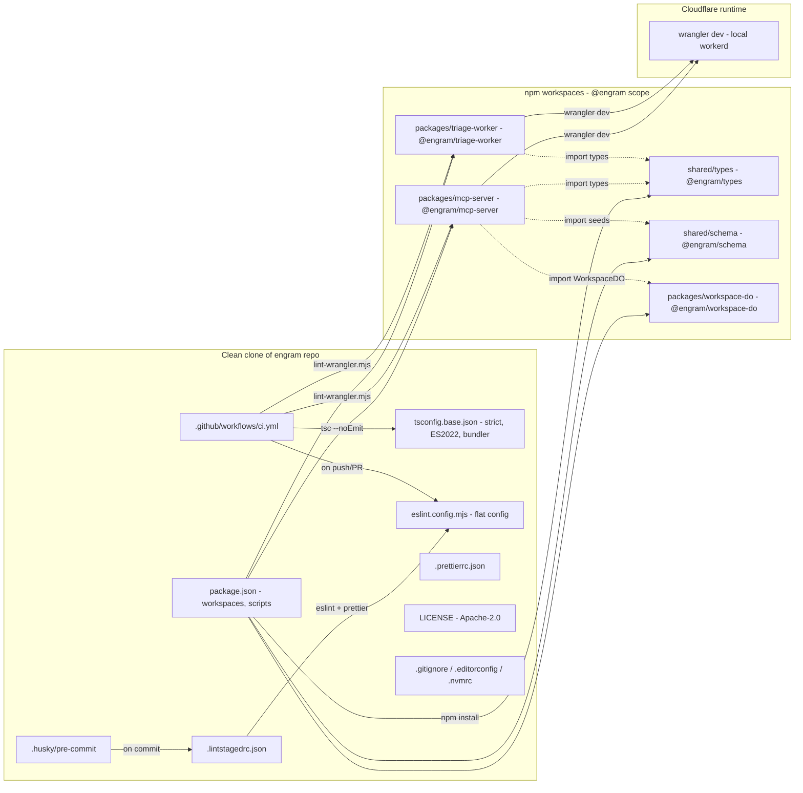

<!-- TODO: confirm owner after first push -->

[](LICENSE)
[](https://github.com/russellkmoore/engram/actions/workflows/ci.yml)
[](package.json)

# Engram

Open-source, MCP-native second brain for AI assistants — persistent memory that the user owns and any MCP client can query.

---

## Why Engram

Every AI client — Claude, Perplexity, Antigravity — faces the same problem: no persistent memory across conversations. Each session starts fresh. Context you built last week is gone. You re-explain your stack, your preferences, your project history, your team, every single time.

Engram fixes that by giving any MCP-compatible client a structured, searchable, semantic memory layer that the user owns and controls. Think of it as your second brain — but built for AI to query, not for humans to browse.

**The key inversion:** Notion was built for humans to browse. Engram is built for AI to query. The MCP tool surface is the product. A human UI is a secondary convenience layer.

Engram does the heavy lifting so Claude doesn't have to. CF Workers AI handles embeddings, entity extraction, chunking, summarization, conflict detection, and deduplication. Claude handles reasoning, synthesis, and user interaction. Engram returns insights — not raw records.

---

## Architecture



> See [docs/architecture.svg](docs/architecture.svg) for the polished hero diagram.

---

## Tech Stack

| Layer               | Technology                                        |
| ------------------- | ------------------------------------------------- |
| Compute             | Cloudflare Workers (TypeScript)                   |
| Workspace storage   | Cloudflare Durable Objects (SQLite per workspace) |
| Semantic search     | Cloudflare Vectorize                              |
| AI processing       | Cloudflare Workers AI                             |
| Async pipeline      | Cloudflare Queues                                 |
| File/export storage | Cloudflare R2                                     |
| Config/metadata     | Cloudflare KV                                     |
| Runtime             | Wrangler + TypeScript                             |
| Package manager     | npm workspaces (monorepo)                         |

---

## Status

**Current milestone:** v0.1 — MCP Foundation (in progress, target 2026-06-07)

Foundation scaffolding (Phase 1) complete. Working on WorkspaceDO + SQLite schema (Phase 2).

See [.planning/ROADMAP.md](.planning/ROADMAP.md) for the full milestone arc.

---

## Getting Started

### Prerequisites

- Node 22+, npm 10+
- A Cloudflare account (only needed for deploy; `wrangler dev` runs locally — no account required)

### Install and run

```bash
# Clone the repo
gh repo clone russellkmoore/engram
cd engram

# Install all workspace dependencies
npm install

# Verify the monorepo is healthy
npm run typecheck && npm run lint && npm run lint:wrangler

# Boot a Worker locally (no Cloudflare account needed)
npm run dev:mcp       # engram-mcp-server on http://localhost:8787
npm run dev:triage    # engram-triage-worker on http://localhost:8788
```

---

## Tool Surface (v0.1)

Engram exposes 5 MCP tools via the `EngramResponse<T>` envelope (see
`shared/types/src/index.ts`). v0.1 ships **honest stubs** — every field is present and typed
correctly, but AI-requiring fields (`synthesis`, `entities`, `confidence`, `conflicts`) are
`null` or `[]` until Phase 5 populates them via Workers AI and Vectorize. The contract shape
is **frozen at v0.1** — Phase 5 is a body change, not a contract change.

### remember

Capture a memory. v0.1 honest-stub posture: no AI classification or entity extraction.

**Request** (source of truth: `packages/mcp-server/src/schemas.ts`):

```typescript
{
  content: string;       // required; min 1 char
  type?: string;         // memory type hint (echoed back as classified_type)
  project?: string;      // project scope
  tags?: string[];       // user-applied tags
  source?: string;       // e.g. "mcp:claude"
  expires?: string;      // ISO 8601 datetime
}
```

**Response** (source of truth: `packages/mcp-server/src/envelope.ts buildRememberResponse`):

```json
{
  "result": {
    "id": "550e8400-e29b-41d4-a716-446655440000",
    "classified_type": "job_application",
    "extracted_fields": {},
    "confidence": null
  },
  "context": { "related": [], "entities": [], "conflicts": [] },
  "meta": {
    "confidence": null,
    "coverage": null,
    "last_updated": 1748300000000,
    "gaps": [
      "AI classification lands in Phase 5. classified_type echoes args.type when supplied.",
      "Conflict detection lands in Phase 5 (semantic similarity via Vectorize)."
    ]
  }
}
```

**v0.1 stubs — Phase 5 populates:**

| Field                     | v0.1                       | Phase 5 source                                                    |
| ------------------------- | -------------------------- | ----------------------------------------------------------------- |
| `result.extracted_fields` | `{}`                       | AI-05 (Triage Worker structured-output extraction)                |
| `result.classified_type`  | echoes `args.type ?? null` | AI-05 (classifier picks best system type when `args.type` absent) |
| `result.confidence`       | `null`                     | AI-05 (classifier confidence score)                               |
| `context.entities`        | `[]`                       | AI-05 (people, companies, projects extracted from content)        |
| `context.conflicts`       | `[]`                       | AI-02 (semantic similarity scan via Vectorize at write time)      |

---

### recall

Search and retrieve memories with optional AI synthesis.

**Request** (source of truth: `packages/mcp-server/src/schemas.ts`):

```typescript
{
  query: string;                              // required; min 1 char
  types?: string[];                           // filter by memory types
  project?: string;                           // scope to a project
  scope?: "personal" | "project" | "org";    // workspace scope filter
  limit?: number;                             // max 25 (D-10 token budget)
  since?: string;                             // ISO 8601 datetime filter
  until?: string;                             // ISO 8601 datetime filter
  verbosity?: "synthesis" | "chunks" | "both"; // default: "both"
}
```

`verbosity` default is `"both"` — returns both `memories` and `chunks` side-by-side. This
follows the Workers AI extraction-quality spike (spike-findings-engram §1 BORDERLINE band):
raw chunks are always returned as a recovery surface for synthesis quality failures. In v0.1,
`synthesis` is always `null`, so `"both"` is purely additive (no overhead).

**Response** (source of truth: `packages/mcp-server/src/envelope.ts buildRecallResponse`):

```json
{
  "result": {
    "memories": [{ "id": "550e8400-...", "content": "...", "created_at": 1748300000000 }],
    "synthesis": null,
    "chunks": [{ "id": "550e8400-...", "content_excerpt": "...", "score": null }]
  },
  "context": { "related": [], "entities": [], "conflicts": [] },
  "meta": {
    "confidence": null,
    "coverage": null,
    "last_updated": 1748300000000,
    "gaps": [
      "AI synthesis lands in Phase 5 (Vectorize + Workers AI). Phase 4 returns lexical (LIKE) matches only."
    ]
  }
}
```

`result.chunks` is **present** when `verbosity` is `"chunks"` or `"both"`; **absent** (key
omitted) when `verbosity` is `"synthesis"`. `meta.last_updated` is `max(memories[].created_at)`
when memories are non-empty, or `Date.now()` when the result set is empty.

**v0.1 stubs — Phase 5 populates:**

| Field                               | v0.1            | Phase 5 source                                                    |
| ----------------------------------- | --------------- | ----------------------------------------------------------------- |
| `result.synthesis`                  | `null` (always) | AI-04 (Workers AI synthesis via `@cf/meta/llama-3.1-8b-instruct`) |
| `result.chunks[].score`             | `null`          | AI-04 (Vectorize cosine score, hybrid-reranked)                   |
| `context.related`                   | `[]`            | AI-04 (Vectorize semantic-adjacency query)                        |
| `context.entities`                  | `[]`            | AI-05 (entity extraction)                                         |
| `meta.confidence` / `meta.coverage` | `null`          | AI-04 (semantic coverage from Vectorize)                          |

---

### search

Structured filter-based memory search. `search` has no `verbosity` parameter — search has no
synthesis to escape from (D-02).

**Request** (source of truth: `packages/mcp-server/src/schemas.ts`):

```typescript
{
  query: string;                           // required; min 1 char
  filters?: Record<string, unknown>;       // field-level filters
  limit?: number;                          // max 25
}
```

**Response** (source of truth: `packages/mcp-server/src/envelope.ts buildSearchResponse`):

```json
{
  "result": {
    "memories": [{ "id": "550e8400-...", "content": "...", "created_at": 1748300000000 }],
    "count": 1
  },
  "context": { "related": [], "entities": [], "conflicts": [] },
  "meta": {
    "confidence": null,
    "coverage": null,
    "last_updated": 1748300000000,
    "gaps": ["Lexical (LIKE) backing — semantic search lands in Phase 5."]
  }
}
```

`result.count` always equals `result.memories.length` — single source of truth, no mismatch
possible. v0.1 stubs are the same as `recall` minus `synthesis` (search has no synthesis
field).

---

### forget

Delete a memory by id, optionally cascading to relations. `forget` is the **one tool that is
not honest-stubbed** — it is the full v0.1 contract.

**Request** (source of truth: `packages/mcp-server/src/schemas.ts`):

```typescript
{
  id: string;         // required; the block UUID to delete
  cascade?: boolean;  // if true, also delete relation rows referencing this block
}
```

**Response** (source of truth: `packages/mcp-server/src/envelope.ts buildForgetResponse`):

```json
{
  "result": {
    "blocks_deleted": 1,
    "relations_deleted": 0
  },
  "context": { "related": [], "entities": [], "conflicts": [] },
  "meta": {
    "confidence": null,
    "coverage": null,
    "last_updated": 1748300000000,
    "gaps": []
  }
}
```

`meta.gaps` is `[]` — `forget` is fully implemented in v0.1. Both `blocks_deleted` and
`relations_deleted` echo the truth from `WorkspaceDO.deleteBlock`. **If the id does not
exist, the envelope returns `result.blocks_deleted: 0` — it does NOT throw a
`NotFoundError`** (Pitfall 4: idempotent delete semantics).

Phase 5 / AI-08 adds Vectorize vector deletion under the same return shape (one-line diff).
Block-cascade to related blocks (vs. just relation rows) is v0.3.

---

### ingest

Async fetch and store. Currently returns a **synthetic accepted** response in v0.1 — the
Queue side-effect lands in Phase 6.

**Request** (source of truth: `packages/mcp-server/src/schemas.ts`):

```typescript
{
  source: string;                     // required; URL or connector reference
  type?: string;                      // memory type hint
  project?: string;                   // project scope
  priority?: "fast" | "deep";         // processing priority (future)
  threshold?: number;                 // memorability threshold 0-1 (future)
}
```

**Response** (source of truth: `packages/mcp-server/src/envelope.ts buildIngestResponse`):

```json
{
  "result": {
    "status": "accepted",
    "job_id": "550e8400-e29b-41d4-a716-446655440000"
  },
  "context": { "related": [], "entities": [], "conflicts": [] },
  "meta": {
    "confidence": null,
    "coverage": null,
    "last_updated": 1748300000000,
    "gaps": ["Async enrichment pipeline lands in Phase 6 — job is recorded but not yet processed."]
  }
}
```

`result.status` is always `"accepted"` in v0.1. `result.job_id` is a UUID generated by
`crypto.randomUUID()` in the handler. No `env.INGEST_QUEUE.send()` call is made in v0.1
(Phase 6 PIP-01/02 is a one-line diff in the handler body; this builder does not change).

---

### Common envelope fields

All 5 tools return the full `EngramResponse<T>` envelope with these cross-cutting fields:

| Field               | Type             | Notes                                                                                                                                                                           |
| ------------------- | ---------------- | ------------------------------------------------------------------------------------------------------------------------------------------------------------------------------- |
| `meta.last_updated` | `number`         | Epoch millis. For memories-returning tools: `max(memories[].created_at)` when non-empty, `Date.now()` when empty. For remember/forget/ingest: `Date.now()`.                     |
| `meta.gaps`         | `string[]`       | Human-readable strings explaining `null` / `[]` fields. Use as a recovery signal — each gap string names which phase ships the real value. Shortens as phases land.             |
| `meta.confidence`   | `number \| null` | `null` in v0.1. Phase 5 populates with aggregate AI confidence.                                                                                                                 |
| `meta.coverage`     | `number \| null` | `null` in v0.1. Phase 5 populates with semantic coverage estimate (matches_returned / matches_estimated via Vectorize).                                                         |
| `suggestions`       | absent           | The `suggestions` key is **omitted entirely** in v0.1 — not present with `undefined`, not present as `{}`. `"suggestions" in envelope` is `false`. Phase 5 / v0.2 may populate. |

---

### Token budget

Every tool response is post-trimmed to **≤ 7,500 cl100k_base tokens** (an 8,000-token safety
ceiling per MCP-08). Token counting uses `gpt-tokenizer/encoding/cl100k_base` which
over-counts vs. Claude's actual BPE by ~5% — this is an intentional safety margin.

Trim priority order when the budget is exceeded:

1. Drop `result.memories[i].content` → set to `null` on each entry.
2. Drop `result.memories[i].summary` → set to `null` on each entry.
3. Drop trailing memories one-by-one until under budget or only 1 remains.

`meta`, `context.conflicts`, and `result.id` (on `remember`) are **never dropped**.

- `recall.limit` and `search.limit` cap at **25** (D-10 back-of-envelope: 25 × 4KB content
  ≈ worst case 100KB raw, but after Step 1 trim ≈ 2,500 tokens — well under budget).
- Each tool description (in the MCP registration) caps at **1,500 UTF-8 bytes** per MCP-08.

---

### Error semantics

All errors throw `McpError` (JSON-RPC `code` + `message`). No ad-hoc `{ error: "..." }`
envelopes. All errors route through
`packages/mcp-server/src/error-mapping.ts mapToMcpError(err)`.

| Code     | Name             | When                                                                                                                                 |
| -------- | ---------------- | ------------------------------------------------------------------------------------------------------------------------------------ |
| `-32602` | `InvalidParams`  | Zod validation failure on tool input, or `NotFoundError` on a referenced id.                                                         |
| `-32600` | `InvalidRequest` | Missing or forged auth — `assertOwnsWorkspace` (STO-07) mismatch. Passed through unchanged.                                          |
| `-32603` | `InternalError`  | Unknown failure. Message is sanitized (≤ 500 chars; `/Users/...` paths → `<path>`; 32+ char hex strings → `<hex>`; no stack traces). |

---

### Source of truth

| Concern                               | File                                                             |
| ------------------------------------- | ---------------------------------------------------------------- |
| Request schemas (all 5 tools)         | `packages/mcp-server/src/schemas.ts`                             |
| Response builders + `META_GAPS`       | `packages/mcp-server/src/envelope.ts`                            |
| `EngramResponse<T>` envelope contract | `shared/types/src/index.ts`                                      |
| Error mapping (`mapToMcpError`)       | `packages/mcp-server/src/error-mapping.ts`                       |
| Architectural rationale               | `CLAUDE.md` §"MCP Tool Surface" + §"Universal Response Envelope" |

---

## Architecture Deep Dive

For full architecture detail — SQLite schema, MCP tool surface, Durable Object topology, build-order dependencies, naming conventions, and the "what goes where" routing rules — see [CLAUDE.md](CLAUDE.md).

---

## License

Licensed under Apache License 2.0 — see [LICENSE](LICENSE). The v1.0 license selection is provisional pending v1.0 confirmation.
