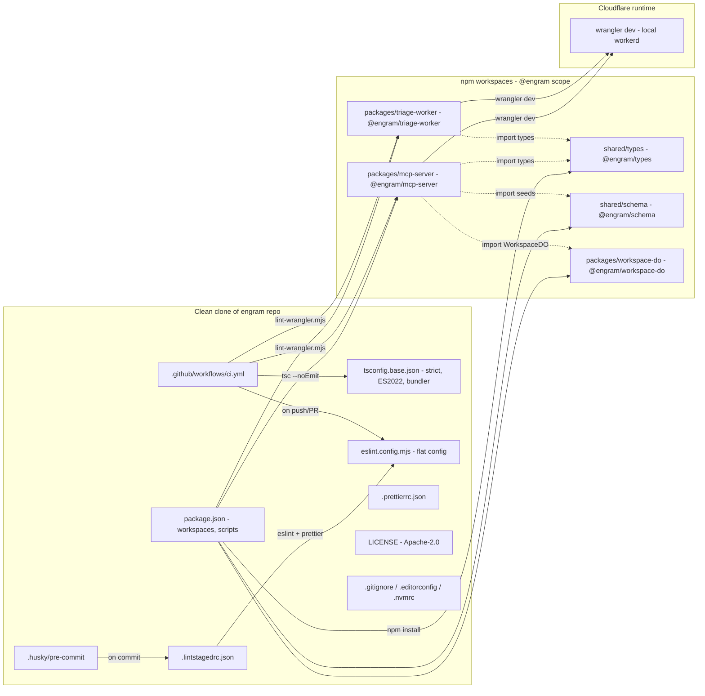

<!-- TODO: confirm owner after first push -->

[](LICENSE)
[](https://github.com/russellkmoore/engram/actions/workflows/ci.yml)
[](package.json)

# Engram

Open-source, MCP-native second brain for AI assistants — persistent memory that the user owns and any MCP client can query.

---

## Why Engram

Every AI client — Claude, Perplexity, Antigravity — faces the same problem: no persistent memory across conversations. Each session starts fresh. Context you built last week is gone. You re-explain your stack, your preferences, your project history, your team, every single time.

Engram fixes that by giving any MCP-compatible client a structured, searchable, semantic memory layer that the user owns and controls. Think of it as your second brain — but built for AI to query, not for humans to browse.

**The key inversion:** Notion was built for humans to browse. Engram is built for AI to query. The MCP tool surface is the product. A human UI is a secondary convenience layer.

Engram does the heavy lifting so Claude doesn't have to. CF Workers AI handles embeddings, entity extraction, chunking, summarization, conflict detection, and deduplication. Claude handles reasoning, synthesis, and user interaction. Engram returns insights — not raw records.

---

## Architecture



> See [docs/architecture.svg](docs/architecture.svg) for the polished hero diagram.

---

## Tech Stack

| Layer               | Technology                                        |
| ------------------- | ------------------------------------------------- |
| Compute             | Cloudflare Workers (TypeScript)                   |
| Workspace storage   | Cloudflare Durable Objects (SQLite per workspace) |
| Semantic search     | Cloudflare Vectorize                              |
| AI processing       | Cloudflare Workers AI                             |
| Async pipeline      | Cloudflare Queues                                 |
| File/export storage | Cloudflare R2                                     |
| Config/metadata     | Cloudflare KV                                     |
| Runtime             | Wrangler + TypeScript                             |
| Package manager     | npm workspaces (monorepo)                         |

---

## Status

**Current milestone:** v0.1 — MCP Foundation (in progress, target 2026-06-07)

Foundation scaffolding (Phase 1) complete. Working on WorkspaceDO + SQLite schema (Phase 2).

See [.planning/ROADMAP.md](.planning/ROADMAP.md) for the full milestone arc.

---

## Getting Started

### Prerequisites

- Node 22+, npm 10+
- A Cloudflare account (only needed for deploy; `wrangler dev` runs locally — no account required)

### Install and run

```bash
# Clone the repo
gh repo clone russellkmoore/engram
cd engram

# Install all workspace dependencies
npm install

# Verify the monorepo is healthy
npm run typecheck && npm run lint && npm run lint:wrangler

# Boot a Worker locally (no Cloudflare account needed)
npm run dev:mcp       # engram-mcp-server on http://localhost:8787
npm run dev:triage    # engram-triage-worker on http://localhost:8788
```

---

## Architecture Deep Dive

For full architecture detail — SQLite schema, MCP tool surface, Durable Object topology, build-order dependencies, naming conventions, and the "what goes where" routing rules — see [CLAUDE.md](CLAUDE.md).

---

## License

Licensed under Apache License 2.0 — see [LICENSE](LICENSE). The v1.0 license selection is provisional pending v1.0 confirmation.
